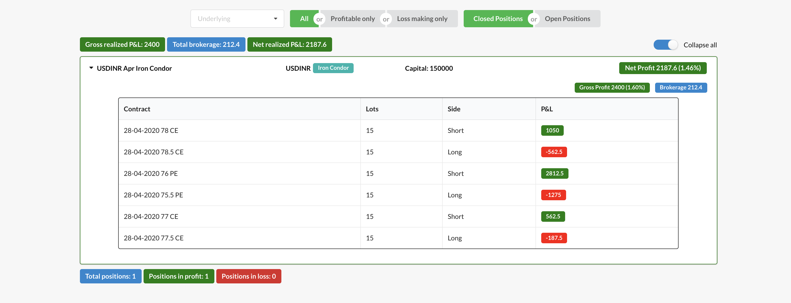

## Start JSON server
```bash
npm run start-server
```

## Update data.json
```bash
node src/data-manipulator.js
```

## Run Webpack server
```bash
npm start
```

## Create a production build
```bash
npm run build
```
